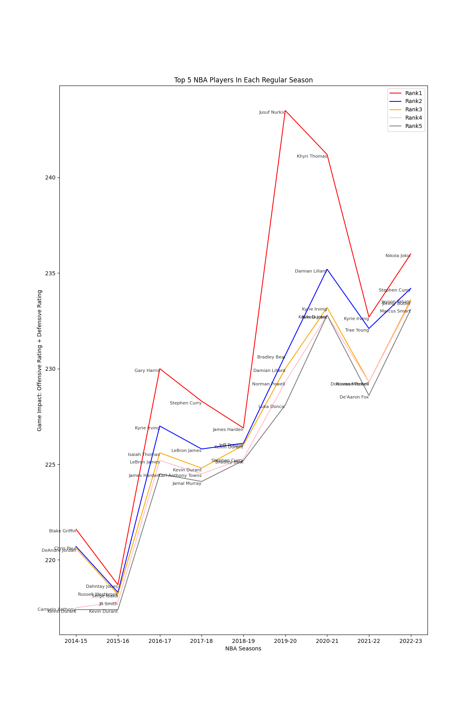
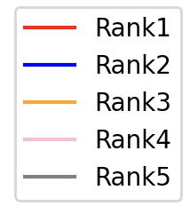

# INFSCI2415 Final Report

#### Zijun Zong 4446212

#### Github Link https://github.com/Dipper30/INFSCI2415FinalReport

## Title

Top 5 NBA Players In Each Regular Season Since 2014-2015

## Figure



## Legend



Five colored lines represent top 5 players in each regular season.

## Findings

1. According to the data, most players in the list are well-known all-star players in that season and their statistics and those teams, in general, achieved big success in that particular season.

    Players most frequently named in the lists are:
      - Kevin Durant: 4 times
      - Stephen Curry: 3 times
      - Kyrie Irvine: 3 times
      - Jokic: 2 times, also known as 2-time MVP
      - Lebron James: 2 times
      - James Harden: 2 times

2. However, some names in the list are lind of counterintuitive. For example, Kyrie Irvine in 2021-2022 season, who was ranked first with respect to the impacts on games, despite the fact that his team did not receive a sound result last year.

3. Point guards can also be rated high in defensive ratings because they are only compared to same positions in the game. That explains why Stephen Curry and Kyrie Irvine were both named 3 times in the list.

## Data And Process

Statistics of over 400 NBA players in each NBA regular season have been collected. Each season's top 5 players are filtered after a simple comparison and calculation.

Data Source Link: https://www.nba.com/stats.

Simple js codes are used to grab the data and convert it into txt files.

Python code is used to analyze the data and draw the graphs.

```python
# Formula
# Players who played at least 30 minutes per game
Impact on game = Official Offensive Rating + Official Defensive Rating
```

## Significance

To better analyze the impacts of the players in the court, some critical statistics included in this project, such as minutes played per game, offensive efficiency in court, as well as defensive efficiency in court.

According to the official statistics, offensive ratings and defensive ratings are calculated by the efficiency. Therefore, we can find the most influential players in the court by simply adding their offensive ratings and defensive ratings. Also, a minimum of 30 minutes played per game guaranteed that the player is one of the main players in the team.

Finally, we can draw the graph and find the most influential players: Kevin Durant, Stephen Curry, Kyrie Irvine. The results are clearly convincing because they won 5 NBA championships in the past 9 years.